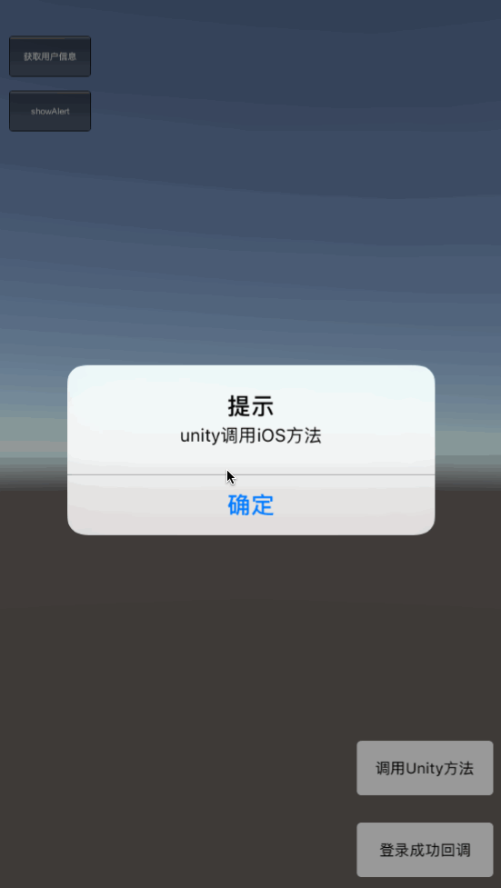
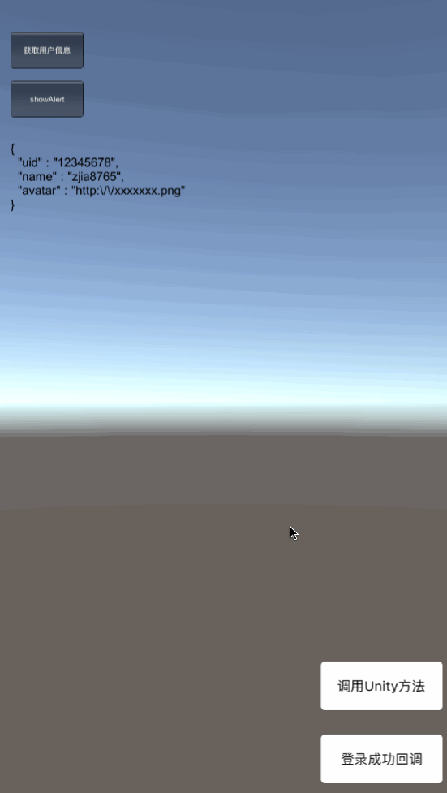

# Unity与iOS消息互传


我们在使用Unity开发iOS平台游戏时，有些功能需要调用iOS原生API或SDK，这就涉及到unity和iOS跨平台的交互，Unity已提供了导出iOS工程的功能，我们可以在Xcode中完成后续工作，下面将对两者交互进行介绍。

####Unity调用iOS函数
- Unity 中函数声明

```
[DllImport("__Internal")]
private static extern void showAlertWithContent (string content);
```

这一段表明会在外部引用一个函数名为`showAlertWithContent`，参数为`content`,返回值为`void`的函数。

- 函数调用

```
void OnGUI() {
	if(GUI.Button(new Rect(20,140,120,60),"showAlert"))
	{
		showAlertWithContent ("unity调用iOS方法");
	}	
}
```

- iOS函数实现

```objectivec
#if defined(__cplusplus)
extern "C" {
#endif
    NSString *CStringToNSString(const char *string)
    {
        if (string)
            return [NSString stringWithUTF8String:string];
        else
            return [NSString stringWithUTF8String:""];
    }
    
    void showAlertWithContent(const char *content)
    {
        [[UnityIOSBridge sharedManager] showAlertWithContent:CStringToNSString(content)];
    }
#if defined(__cplusplus)
}
#endif
```

在`UnityIOSBridge`类中使用OC实现`showAlertWithContent`函数即可。
效果如下:




####iOS调用Unity函数
##### 方式一：
Unity为我们提供了一个方法，不管是iOS还是Android，调用Unity都是这个方法，但MacOS不支持.
> UnitySendMessage("GameObjectName", "MethodName", "Message to send");

第一个参数`GameObjectName`为组件名称<br>
第二个参数`MethodName`为方法名<br>
第三个参数`Message to sen`为调用函数时传入的参数

- Unity中实现

```
void updateLabelContent(string content)
{
	labelValue = content;
}
```

- iOS中调用

```objectivec
UnitySendMessage("Main Camera","updateLabelContent",[text UTF8String]);
```

效果如下:



**该方式扩展性较差，iOS无法接收到Unity中方法返回值，并且`UnitySendMessage`只能传一个参数，若有多个参数，则需拼成字符串**

##### 方式二：
使用Mono的跨平台机制，通过`[MonoPInvokeCallback(typeof(CallBack))]`来实现方法回调。该方式适用iOS、Android，和MacOS。

- Unity 中函数声明

```
delegate int CallBack(string param);  
[DllImport("__Internal")]
static extern void loginWithFinishCallBack(CallBack cb);
[MonoPInvokeCallback(typeof(CallBack))]  
```

- Unity中调用`loginWithFinishCallBack`函数

```
static int UnityLoginFinsihCallBack(string param) {  
		Main.labelValue = param;
		Debug.Log("LoginFinsih>>>>>" + param);  
		return 100;
}  
void Start () {
	loginWithFinishCallBack (Main.UnityLoginFinsihCallBack);
}
```

- iOS中函数声明

```
typedef int (*Unity_CallBack)(const char * p);
......

#if defined(__cplusplus)
extern "C" {
#endif
    void loginWithFinishCallBack(Unity_CallBack callback){
        [UnityIOSBridge sharedManager].callBack = callback;
    }
#if defined(__cplusplus)
}
#endif
```

- iOS中函数回调，`UnityIOSBridge`类中通过`callBack`回调

```
- (void)loginFinishCallBackFunc {
    NSString *text = [UnityIOSBridge stringTransformFromDictionary:@{@"code":@"0",@"result":@{@"uid":@"12345678",@"name":@"zjia8765",@"avatar":@"http://xxxxxxx.png"}}];
    int index = self.callBack([UnityIOSBridge charFromString:text]);
    NSLog(@"index = %@",@(index));
}
```

**通过以上实现可以看出，该回调方式扩展性较强，支持任意参数传递，并且可接收Unity中函数返回值**

最后附上[Demo](https://github.com/zjia8765/XXXGameDemo)，由于github上传大于100M的文件会报错，Unity工程导出Xcode工程后，会生成`libiPhone-lib.a`文件，该文件较大，可点击[libiPhone-lib.a](http://pan.baidu.com/s/1c2ansVQ)下载，手动把`libiPhone-lib.a`放到`/XXXGameXcode/Libraries`目录下即可。
